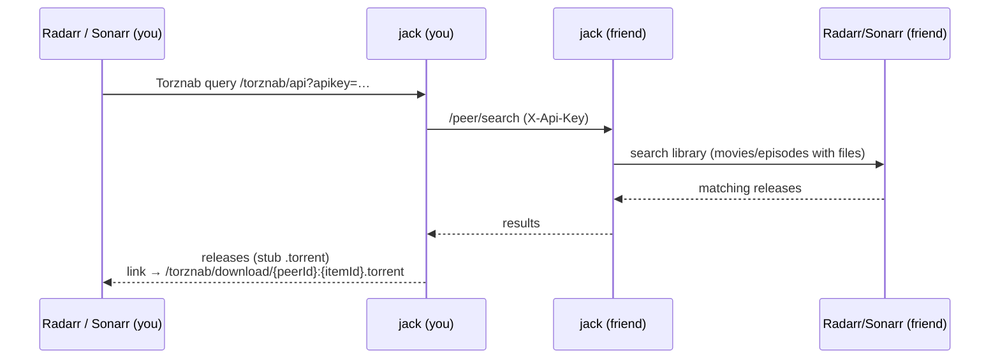
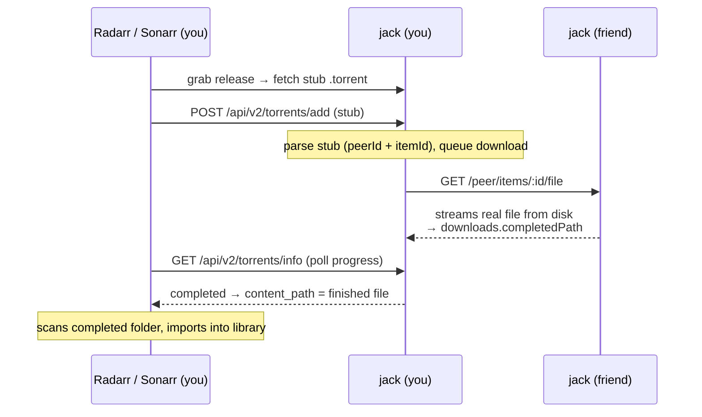

# jack

**jack** lets you and your friends share media libraries with each other through
the *arr stack you already run. You point Radarr/Sonarr at jack, search like you
would on any indexer, and when a friend has the movie or episode you want, jack
pulls it straight from their server into your library — no public trackers, no
BitTorrent swarm, just a private peer-to-peer bridge between your media servers.

Built with [Bun](https://bun.com) and [Hono](https://hono.dev).

## Table of contents

- [Concepts](#concepts)
- [Quick start (Docker Compose)](#quick-start-docker-compose)
- [Management UI](#management-ui)
- [How it works](#how-it-works)
- [API keys](#api-keys)
- [Configuration](#configuration)
- [Environment variables](#environment-variables)
- [Health check](#health-check)
- [CLI and local API](#cli-and-local-api)
- [Running without Docker](#running-without-docker)
- [Troubleshooting](#troubleshooting)
- [Development](#development)
- [Project layout](#project-layout)

## Concepts

jack sits between three kinds of servers. You only need to configure the ones
relevant to what you want to do (share, consume, or both).

jack talks to **Radarr/Sonarr** for everything — there's no separate media
server. Each server you configure is one entry in `servers`, with two role
flags (it can be either, or both):

| Role | What it does | You need it to… |
| --- | --- | --- |
| **`source`** | jack reads your Radarr/Sonarr library and serves it to peers: it searches your movies/episodes that have files and streams those files. | **Share** your library with friends. |
| **`destination`** | jack registers itself in that Radarr/Sonarr as a Torznab indexer + qBittorrent download client and triggers imports of finished downloads. | **Consume** — drive everything from your existing *arr UI. |
| **Peer** | Another **jack** instance — a friend. You list their URL + API key under `peers`; jack queries them when your *arr searches. | **Consume** media your friends have. |

So a typical "both" setup has your Radarr/Sonarr as `source: true` **and**
`destination: true` (share your library *and* search your friends'), plus some
**peers** (friends, to consume from).

> **Torznab** is the search API that indexers speak to Radarr/Sonarr (the same
> protocol Prowlarr/Jackett expose). jack pretends to be a Torznab indexer so
> your *arr apps can search your friends' libraries with zero special setup —
> to them, jack looks like any other indexer.

## Quick start (Docker Compose)

Running with Docker Compose is the recommended way to self-host jack. Two images
are published to GitHub Container Registry on every push to `main` — the backend
(`ghcr.io/roziscoding/jack:main`) and the management UI
(`ghcr.io/roziscoding/jack-ui:main`) — so you don't need to clone the repo. Just
grab [`examples/docker-compose.yml`](examples/docker-compose.yml) and
[`examples/config.jsonc`](examples/config.jsonc) and drop them in a folder:

```bash
# 1. Create your config from the template
mkdir -p config
cp config.jsonc config/config.jsonc   # the template you downloaded
$EDITOR config/config.jsonc           # fill in your servers (see below)

# 2. Set a management key (gates the management API + the UI's access to it)
echo "JACK_MANAGEMENT_KEY=$(openssl rand -base64 32)" > .env

# 3. Pull and run
docker compose up -d

# 4. Watch the logs
docker compose logs -f
```

You should see `Server listening` and, if you configured destinations,
`Registered Jack as Torznab indexer` and `Registered Jack as qBittorrent
download client` lines.

The management UI comes up at **http://localhost:3000** — see
[Management UI](#management-ui) for what it does and how to secure it.

The compose file mounts three host paths — adjust them for your setup:

| Mount | Purpose | Related config |
| --- | --- | --- |
| `./config` → `/config` | App config | `APP_CONFIG_PATH` |
| `${MEDIA_PATH:-./data/media}` → `/data/media` | Your media, so jack can stream it to peers | must match the paths Radarr/Sonarr report |
| `${TORRENTS_PATH:-./data/torrents}` → `/data/torrents` | Completed downloads dir | `downloads.completedPath` |

> **Networking:** Radarr/Sonarr reach jack's qBittorrent API at `jack.internalUrl`,
> so it must be resolvable from *their* side. If they run in their own Docker
> network, uncomment the `networks:` block in the compose file so jack joins it,
> and set `jack.internalUrl` to something they can resolve (e.g. `http://jack:5225`).
> Otherwise use the host IP.

> ⚠️ **Mount the completed folder into Radarr/Sonarr too.** jack writes finished
> downloads to the **literal** `downloads.completedPath`, and your Radarr/Sonarr
> import them by resolving that path in *their own* filesystem. So the same
> completed folder must be mounted into your **Radarr and Sonarr** containers at
> the **exact same path** jack uses (e.g. `/data/torrents/completed`). If they
> don't line up, *arr can't import the finished file, and every grab fails.
> (There's no watch folder anymore —*arr hands grabs to jack over the
> qBittorrent API, not through a dropped `.torrent`.)

> ⚠️ **Mount your media at the same path Radarr/Sonarr report.** jack streams
> files straight from disk using the absolute path each *arr stores for the file
> (`movieFile.path` / `episodeFile.path`) — i.e. the path *inside the
> Radarr/Sonarr container*. Mount your media into jack at that **same path** (you
> may need to mirror more than one, e.g. `/movies` and `/tv`). The `/data/media`
> in the example is just a placeholder — replace it with whatever paths your
>*arr use. **Migrating from the Jellyfin-based version?** This path likely
> changed: it's now the *arr path, not Jellyfin's library path.

## Management UI

jack ships with a web console — the **management UI** — so you can run your
instance without hand-editing `config.jsonc`. It's the easiest way to operate
jack day to day:

- **Overview** — your configured servers and peers, and whether each one
  initialized cleanly.
- **Downloads** — in-flight and finished grabs.
- **Peers** — add, edit, and remove the friends you consume from.
- **Servers** — add, edit, and remove your Radarr/Sonarr connectors.

It's a Nuxt **BFF** (backend-for-frontend): it serves the SPA and proxies every
call to jack's **management API**. In injected mode the BFF adds the key without
exposing it to the browser; in cookie mode the browser submits it once and the
BFF keeps it in a sealed `HttpOnly` cookie. The management API is a *separate*
listener from the public peer/Torznab port — it only starts when the backend has
`JACK_MANAGEMENT_KEY` or the legacy `MANAGEMENT_KEY` set (see
[Environment variables](#environment-variables)), and the UI talks only to it,
never to the public peer API.

With the [Quick start](#quick-start-docker-compose) compose file the UI runs as
the `jack-ui` service and comes up at **http://localhost:3000** (override the
host port with `JACK_UI_PORT`). Don't want it? Delete the `jack-ui` service and
the backend's `JACK_MANAGEMENT_KEY` line to run jack headless.

### Access control

The UI supports two auth modes, depending on where the management key comes from:

1. **Injected (feels authless).** Set `JACK_MANAGEMENT_KEY` in the UI's env (the
   compose file wires this for you). The BFF adds the key on every request and
   the browser is never prompted — put a proxy (Cloudflare Access, Traefik
   forward-auth, …) in front of it to gate access.
2. **Cookie prompt.** Leave `JACK_MANAGEMENT_KEY` unset. The browser is prompted
   for the key once; it's validated against the management API and stored in a
   sealed `HttpOnly` cookie. Set `JACK_SESSION_KEY` (≥ 32 chars) in production to
   seal that cookie.

See [`apps/ui/README.md`](apps/ui/README.md) for the full UI configuration
reference.

## How it works

There are two flows: **searching** for media (Torznab) and **downloading** it
(the qBittorrent API). The `.torrent` files involved are *not real torrents* —
they're tiny stubs jack hands to *arr, which sends them back to jack through the
qBittorrent download-client API. Nothing ever touches BitTorrent.

### 1. Search flow (Torznab)



1. On startup jack **registers itself as a Torznab indexer** in each `destination`
   server (Radarr/Sonarr), using `jack.internalUrl` + an auto-issued **managed key**, and
   **registers a qBittorrent download client** pointing back at jack's own
   qBittorrent API (`jack.internalUrl`, only if `downloads` is configured). (Auto,
   unless you set that server's `autoregister.enable: false`.)
2. When you search or monitor something, Radarr/Sonarr query jack's `/torznab`
   endpoint with that managed key.
3. jack **fans the query out to every `peer`** you've configured, calling their
   `/peer/search` (authenticated with that peer's API key).
4. Each peer searches **its own Radarr/Sonarr** library (movies/episodes that
   have files) and returns matching releases, mirroring the *arr file metadata.
5. jack turns each match into a Torznab "release" whose download link points
   back at itself: `/torznab/download/<peerId>:<itemId>.torrent`.
6. Radarr/Sonarr show these as grabbable releases — indistinguishable from a
   normal indexer's results.

### 2. Download flow (qBittorrent API)



1. You grab a release. Your *arr's download client is a **qBittorrent** client
   pointed at jack's own qBittorrent API (jack registers this client for you on
   startup), so*arr fetches the stub `.torrent` from jack and immediately POSTs
   it back to jack at `/api/v2/torrents/add`.
2. That `.torrent` is a **stub** — bencoded data that just encodes the
   `peerId` and `itemId`. No trackers, no pieces; it's never written to disk.
3. jack parses the stub, finds the matching peer, and queues the download.
4. jack **downloads the real file over HTTP** from that peer's
   `/peer/items/:id/file` endpoint into `downloads.completedPath`.
5. *arr polls jack's qBittorrent API (`/api/v2/torrents/info`) for progress;
   once jack reports the torrent complete,*arr scans the completed folder and
   imports the file into your library, renamed and tracked.

### 3. Serving (being a peer to others)

When a friend lists *you* as a peer, their jack calls your `/peer/*` endpoints,
authenticated with the peer API key you issued them:

- `/peer/search` — search your Radarr/Sonarr library.
- `/peer/items/:id` — release metadata.
- `/peer/items/:id/file` — stream the actual file.

jack streams files straight from disk using the paths your Radarr/Sonarr report,
so **the jack process must be able to read your media files at those same paths**
(mount your media into the container the same way your *arr apps see it).

## API keys

jack authenticates each external surface by **key type**, so a credential only
works where it's meant to (`/ping` is the only unauthenticated route):

- **Peer API keys.** Issued per peer from the management UI's *API keys* section
  (or the management API) — named, revocable, and optionally expiring. Scoped to
  the **peer API** (`/handshake`, `/peer/*`): a peer key **cannot** query your
  Torznab indexer or act as your download client.
- **Managed keys.** jack mints these automatically and registers them in your
  Radarr/Sonarr when it auto-registers as their indexer + download client. Scoped
  to the ***arr surface** (`/torznab`, the qBittorrent API); you never see or
  handle them.

So keys flow in two directions:

- Your **Radarr/Sonarr** authenticate with the managed key jack registered for
  them (as the Torznab `apikey` and the download-client password).
- Your **peers** send the peer API key you issued them as the `X-Api-Key` header
  when they search or download from you.

### Sharing with friends (peering)

Peering is symmetric — you each run jack and exchange two things: a URL where
the other instance can reach your peer API and a **peer API key**. This public or
LAN-reachable peer URL is independent of `jack.internalUrl`, which is the address
your own Radarr/Sonarr use to reach jack.

- **You give a friend** your reachable peer URL plus a peer API key you issue them
  (management UI → *API keys*). They add you under `peers` in *their* config:

  ```jsonc
  {
    "peers": [
      { "name": "you", "url": "https://your-jack.example.com", "apiKey": "<the key you issued them>" }
    ]
  }
  ```

- **They give you** theirs, and you add them the same way in your config.

After that, each side's Radarr/Sonarr can find and pull media the other has.

> 💡 Issue a **separate key per peer**. Each is scoped to the peer API — it can't
> reach your indexer or download client — and can be revoked individually without
> disrupting your other peers.

> 🔒 Use **`https://`** for peer URLs. The key travels in the `X-Api-Key` request
> header, so a plain `http://` peer exposes it in transit to anything on the path.
> jack logs a warning at startup for any peer configured over `http://`.

## Configuration

jack reads a [JSONC](https://github.com/microsoft/node-jsonc-parser) file
(comments allowed) from `APP_CONFIG_PATH` (default `/config/config.jsonc`). If
the file doesn't exist, jack writes a default one on first boot. Copy
[`examples/config.jsonc`](examples/config.jsonc) as a starting point.

The `jack` block is required. `downloads`, `servers`, and `peers` are optional —
configure only what you need for what you're doing.

```jsonc
{
  // This instance's identity. internalUrl is where your own *arr apps reach jack.
  "jack": {
    "internalUrl": "http://jack:5225" // URL your own *arr apps use to reach jack
  },

  // Downloads. Needed to *consume* (download) from peers — jack registers
  // itself as a qBittorrent download client and writes finished files here.
  // Path is inside the container; jack creates it if missing.
  "downloads": {
    "completedPath": "/data/torrents/completed" // jack writes finished files here
  },

  // Your Radarr/Sonarr servers. Each can be a source, a destination, or both.
  "servers": [
    {
      "name": "Main Radarr",
      "type": "radarr", // "radarr" | "sonarr"
      "url": "http://radarr:7878",
      "apiKey": "<32 hex chars>", // *arr API key (Settings → General)
      "headers": { "X-Forwarded-User": "jack" }, // optional extra outbound headers
      "source": true, // share this library with peers
      "destination": true, // register jack here + import grabs
      "autoregister": { // indexer/client registration (destinations)
        "enable": true, // set false to register it yourself
        "priority": 1 // indexer priority in *arr (lower = preferred)
      }
    },
    { "name": "Main Sonarr", "type": "sonarr", "url": "http://sonarr:8989", "apiKey": "<32 hex chars>" }
  ],

  // Other jack instances (friends) you consume from. Sources only.
  "peers": [
    {
      "name": "friend",
      "url": "https://their-jack.example.com",
      "apiKey": "...",
      "headers": {
        "CF-Access-Client-Id": { "env": "FRIEND_CF_CLIENT_ID" },
        "CF-Access-Client-Secret": { "env": "FRIEND_CF_CLIENT_SECRET" }
      }
    }
  ]
}
```

`source`, `destination` default to `true`; `autoregister` defaults to
`{ "enable": true, "priority": 1 }`.

Field notes:

- **`jack.internalUrl`** must be reachable by your own *arr apps. On a shared
  Docker network use the container name; otherwise the host IP/domain. Peers use
  the separate URL configured in their `peers[].url` entry for your instance.
- **`peers[].apiKey`** is the peer API key that peer issued *you* (see
  [API keys](#api-keys)), not your own.
- **`servers[].name` / `peers[].name`** are required display names used in logs,
  health output, and search results.
- **`servers[].apiKey`** is the Radarr/Sonarr API key — **exactly 32 hex
  characters** (Settings → General).
- **`servers[].headers` / `peers[].headers`** are optional extra HTTP headers
  sent to that server/peer. Header values support the same plain-string or
  `{ "env": "NAME" }` / `{ "file": "/absolute/path" }` secret forms as API keys.
  Use these for reverse proxies or access layers such as Cloudflare Access,
  Authelia, or a custom gateway. These are outbound connector headers only; jack
  still adds the required *arr `X-Api-Key` or peer `X-Api-Key` auth header
  separately.
- **`downloads.completedPath`** must also be mounted into your **Radarr and
  Sonarr** containers at the **same path** — jack writes finished files there and
  *arr resolves that path in its own filesystem to import them (see the callout in
  [Quick start](#quick-start-docker-compose)). The other `downloads.*` keys are
  optional tuning knobs (concurrency and retry backoff).
- **Download client isolation.** jack registers its qBittorrent client at *arr's
  **lowest** priority (50).*arr's general client pool only round-robins among the
  best-priority group, so real torrents grabbed from your other indexers never get
  routed to jack's client (they'd be rejected anyway). Grabs from the Jack indexer
  still reach it because the indexer is bound to the client explicitly
  (`downloadClientId`), which *arr resolves before applying priority. No tags or
  extra config needed.

### Secrets from environment variables or files

Any `apiKey` can be given as a plain string, as a reference to an environment
variable, or as a reference to a secret file, so secrets can stay out of the
config file:

```jsonc
{
  "servers": [
    // resolved from $RADARR_API_KEY at startup
    { "name": "Main Radarr", "type": "radarr", "url": "http://radarr:7878", "apiKey": { "env": "RADARR_API_KEY" } }
  ]
}
```

```jsonc
{
  "servers": [
    // path must be absolute
    { "name": "Main Radarr", "type": "radarr", "url": "http://radarr:7878", "apiKey": { "file": "/run/secrets/radarr_api_key" } }
  ]
}
```

All three forms are interchangeable everywhere an `apiKey` appears (`servers`,
`peers`) and for `servers[].headers` / `peers[].headers` values. The plain-string
form keeps working unchanged. File paths must be absolute; trailing line endings
are ignored. If a referenced variable is unset/empty, or a secret file cannot be
read or resolves to an empty value at startup, jack reports the problem and
refuses to load that config.

## Environment variables

| Var | Default | Description |
| --- | --- | --- |
| `PORT` | `5225` | HTTP port |
| `LOG_LEVEL` | `info` | `trace`/`debug`/`info`/`warn`/`error`/`fatal` |
| `ENVIRONMENT` | `development` | `production` switches logs to JSON (no pretty-print) |
| `APP_CONFIG_PATH` | `/config/config.jsonc` | Path to the config file |
| `JACK_MANAGEMENT_KEY` | unset | Preferred management API key. When set, the management API starts on `MANAGEMENT_PORT` and every request must carry `X-Management-Key: <this>` |
| `MANAGEMENT_KEY` | unset | Backwards-compatible alias for `JACK_MANAGEMENT_KEY`; ignored when the prefixed variable is also set |
| `MANAGEMENT_PORT` | `5226` | Port for the management API listener, separate from `PORT` so the peer-facing port never exposes management. Only used when a management key is set |
| `HTTP_TIMEOUT_MS` | `30000` | Default timeout, in milliseconds, for outbound connector requests |
| `OTEL_EXPORTER_OTLP_ENDPOINT` | unset | Enables OpenTelemetry traces and logs and sends OTLP/HTTP data to this base endpoint |
| `OTEL_EXPORTER_OTLP_TRACES_ENDPOINT` | unset | Also enables OpenTelemetry when set; useful if traces use a signal-specific endpoint |
| `OTEL_SERVICE_NAME` | `jack-backend` | Service name attached to emitted telemetry |
| `ENABLE_LOGS` | `true` | Set false to disable pino logging; logs are also disabled automatically when `NODE_ENV=test` |
| `LOG_TO_FILE` | `true` | Persist logs to rotating NDJSON files for the management API and UI; disabled automatically when `NODE_ENV=test` |
| `LOG_DIR` | `logs` next to `APP_CONFIG_PATH` | Directory for persisted log files |
| `LOG_MAX_FILE_BYTES` | `10485760` | Rotate the active log file after this many bytes (10 MiB by default) |
| `LOG_MAX_FILES` | `5` | Number of rotated files to retain, in addition to the active file |

> Set `LOG_LEVEL=trace` to log every HTTP request — method, path, response
> status, and duration — as it completes.

When an OTLP endpoint is configured, jack emits request traces and bridges pino
logs into OpenTelemetry logs. Request spans include redacted headers/query
attributes and bounded textual request/response bodies; binary bodies are
omitted. See [`examples/compose-with-otel.yml`](examples/compose-with-otel.yml)
for a compose setup with OpenObserve.

## Health check

jack exposes an unauthenticated `GET /ping` that returns `{ "status": "OK" }`
with a `200`, handy for uptime monitors and orchestrators:

```bash
curl http://localhost:5225/ping
# {"status":"OK"}
```

The Docker image wires this endpoint up as a built-in `HEALTHCHECK`, so
`docker ps` and Compose report the container's health automatically — no extra
configuration needed.

## CLI and local API

The repo includes a small Bun CLI for talking to a running jack:

```bash
JACK_URL=http://localhost:5225 \
JACK_API_KEY=your-key \
bun scripts/cli.ts api GET /handshake
```

Supported commands:

- `bun scripts/cli.ts api [METHOD] <path> [items...]` — generic HTTP request.
  Items use httpie-style syntax: `key==query`, `key=body`, `key:=rawjson`, or
  `Header:value`.
- `bun scripts/cli.ts peer search [--imdbId id] [--tmdbId id] [--tvdbId id] [--season n] [--episode n]` — call your local `/peer/search`.
- `bun scripts/cli.ts torznab search [--imdbId id] [--tmdbId id] [--tvdbId id] [--season n] [--episode n] [--cat id]` — call `/torznab/api` and print XML.

Operational endpoints (peer-facing app):

- `GET /ping` — unauthenticated health check.
- `GET /handshake` — identity + protocol version (authenticated).

Connector, status and download views are **not** on the peer-facing app — they would
leak peer/server names and URLs to peers. They live on the management API (separate
port, authenticated with the management key): `GET /config/servers`, `GET /config/peers`,
`GET /overview`, and `GET /downloads`.

## Running without Docker

```bash
bun install

APP_CONFIG_PATH=./config/config.jsonc \
ENVIRONMENT=production \
PORT=5225 \
bun apps/backend/src/index.ts
```

For local development with hot reload:

```bash
mise run dev     # bun --cwd apps/backend --hot src/index.ts
```

## Troubleshooting

Registration runs on every startup and logs the *arr response body, so check
`docker compose logs jack` first. The common failures:

### qBittorrent download client test fails / `Failed to register download client`

The qBittorrent client *arr registers (or the "Test" button in
Settings → Download Clients) connects to jack's qBittorrent API at the host/port
jack derives from `jack.internalUrl`. A failing test almost always means*arr can't
reach that address.

**Fix:** make sure `jack.internalUrl` is resolvable **from the Radarr/Sonarr side**.
On a shared Docker network use the container name (`http://jack:5225`); otherwise
the host IP/domain. If *arr and jack are on different networks, attach jack to
*arr's network (the `networks:` block in the example compose).

### Grabs download but never import

The download completes in jack (you see it finish in the logs) but Radarr/Sonarr
never pick the file up. jack writes finished files to the **literal**
`downloads.completedPath`, and *arr imports them by resolving that path in **its
own** filesystem — so the completed folder must exist at the **same path** inside
the Radarr/Sonarr containers.

**Fix:** mount the **same host folder** into Radarr **and** Sonarr at the **same
container path** jack uses. If jack has:

```yaml
# jack
volumes:
  - /srv/media/jack-completed:/data/torrents/completed
```

then Radarr and Sonarr each need:

```yaml
# radarr AND sonarr
volumes:
  - /srv/media/jack-completed:/data/torrents/completed
```

Two gotchas:

- **Use a dedicated completed folder.** Don't point `completedPath` at a folder
  another download client (e.g. a real qBittorrent's `/downloads`) already writes
  to, or *arr will try to import unrelated files.
- **Permissions.** jack runs as **uid/gid 1000**, matching the `PUID/PGID` the
  linuxserver.io *arr images default to, so files jack writes are owned by the
  same user that imports them. Make sure the completed folder (and the `/config`
  mount) are readable/writable by uid 1000 — `chown -R 1000:1000` them; if your
*arr uses a different `PUID`, set it to match.

### `No "downloads" config set` — no download client registered

```
No "downloads" config set; skipping download client auto-registration. Grabs will fail until a qBittorrent client is configured.
```

jack only registers the qBittorrent download client when a `downloads` block is
present in your config (it needs `completedPath` to know where to write files).
Without it, the Torznab indexer is still registered so searches work, but grabs
have nowhere to go.

**Fix:** add a `downloads` block with `completedPath` and restart jack.

If registration fails with `Failed to register indexer`, check that the
destination server is reachable and its API key is correct — registration logs
the raw *arr response body at `error` level.

### `ConnectionRefused` on startup

```
Failed to initialize connector radarr: Unable to connect. Is the computer able to access the url?
```

jack tries to connect to your servers at boot. If it starts before Radarr/Sonarr
are ready, those connectors fail initially and you'll see `sources:0` /
`destinations:0` in the `Server listening` line. Source and peer connectors are
retried lazily the next time a search/download needs them, so they can recover
without a restart once the remote service is up.

Auto-registration still runs only during startup, so a destination that was down
at boot may need a jack restart before the Torznab indexer or qBittorrent
download client is created in Radarr/Sonarr. To make startup deterministic, wait
for the dependencies to be healthy:

```yaml
# jack
depends_on:
  radarr: {condition: service_healthy}
  sonarr: {condition: service_healthy}
```

(This needs `healthcheck` blocks on those services — the linuxserver.io images
ship with them.)

### Seeing what jack is doing

Set `LOG_LEVEL=trace` to log every HTTP request (method, path, status,
duration). Registration failures always log the raw *arr response body at
`error` level, which carries the real validation message — read that body, it
usually tells you exactly what*arr is unhappy about.

## Development

```bash
bun test         # run tests
mise run lint    # lint
mise run lint:fix
```

API types for external services are generated from OpenAPI specs:

```bash
mise run clients   # regenerate packages/schemas/src/generated
```

## Project layout

```
apps/backend            # the Hono server (Torznab, peer API, qBittorrent API)
apps/backend/Dockerfile # backend production image (build context = repo root)
apps/ui                 # the management console (Nuxt BFF)
apps/ui/Dockerfile      # management UI image (build context = repo root)
packages/schemas        # generated Radarr/Sonarr API types
examples/               # docker-compose.yml + config.jsonc template
```
