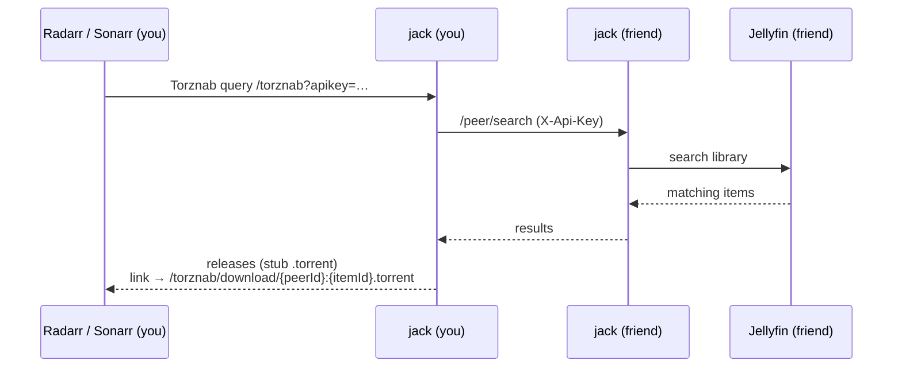
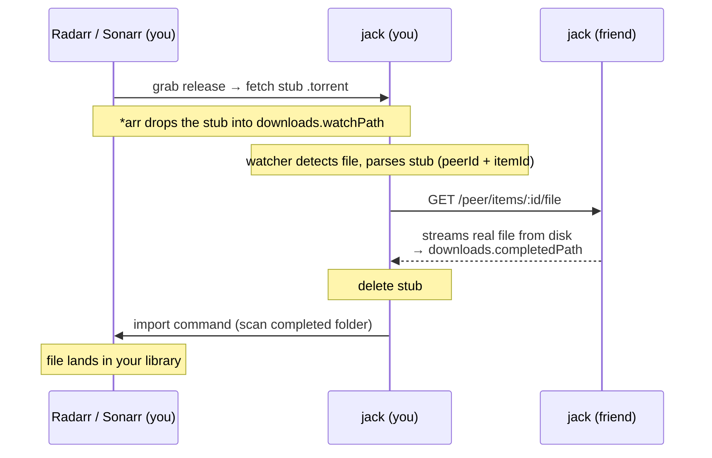

# jack

**jack** lets you and your friends share media libraries with each other through
the *arr stack you already run. You point Radarr/Sonarr at jack, search like you
would on any indexer, and when a friend has the movie or episode you want, jack
pulls it straight from their server into your library — no public trackers, no
BitTorrent swarm, just a private peer-to-peer bridge between your media servers.

Built with [Bun](https://bun.com) and [Hono](https://hono.dev).

## Table of contents

- [Concepts](#concepts)
- [Quick start (Docker Compose)](#quick-start-docker-compose)
- [How it works](#how-it-works)
- [The API key](#the-api-key)
- [Configuration](#configuration)
- [Environment variables](#environment-variables)
- [Health check](#health-check)
- [Running without Docker](#running-without-docker)
- [Troubleshooting](#troubleshooting)
- [Development](#development)
- [Project layout](#project-layout)

## Concepts

jack sits between three kinds of servers. You only need to configure the ones
relevant to what you want to do (share, consume, or both).

| Concept | What it is | You need it to… |
| --- | --- | --- |
| **Source** | A media server jack reads from — currently **Jellyfin**. It's *your* library: jack searches it and streams its files to peers. | **Share** your library with friends. |
| **Peer** | Another **jack** instance — a friend. You list their URL + API key; jack queries them when your *arr searches. | **Consume** media your friends have. |
| **Destination** | A **Radarr** or **Sonarr** instance. jack registers itself there as a Torznab indexer and tells it to import finished downloads. | **Consume** — drive everything from your existing *arr UI. |

So a typical "both" setup has: a **source** (your Jellyfin, to share), some
**peers** (friends, to consume from), and **destinations** (your Radarr/Sonarr,
to search and import).

> **Torznab** is the search API that indexers speak to Radarr/Sonarr (the same
> protocol Prowlarr/Jackett expose). jack pretends to be a Torznab indexer so
> your *arr apps can search your friends' libraries with zero special setup —
> to them, jack looks like any other indexer.

## Quick start (Docker Compose)

Running with Docker Compose is the recommended way to self-host jack. The image
is published to GitHub Container Registry (`ghcr.io/roziscoding/jack:main`) on
every push to `main`, so you don't need to clone the repo — just grab
[`examples/docker-compose.yml`](examples/docker-compose.yml) and
[`examples/config.jsonc`](examples/config.jsonc) and drop them in a folder:

```bash
# 1. Create your config from the template
mkdir -p config
cp config.jsonc config/config.jsonc   # the template you downloaded
$EDITOR config/config.jsonc           # fill in your servers (see below)

# 2. Pull and run
docker compose up -d

# 3. Watch the logs
docker compose logs -f
```

You should see `Server listening` and, if you configured destinations,
`Registered Jack as Torznab indexer` and `Registered Jack as Torrent Blackhole
download client` lines.

The compose file mounts three host paths — adjust them for your setup:

| Mount | Purpose | Related config |
| --- | --- | --- |
| `./config` → `/config` | App config | `APP_CONFIG_PATH` |
| `${MEDIA_PATH:-./data/media}` → `/data/media` | Your media, so jack can stream it to peers | must match the paths Jellyfin reports |
| `${TORRENTS_PATH:-./data/torrents}` → `/data/torrents` | Blackhole watch/completed dirs | `downloads.watchPath`, `downloads.completedPath` |

> **Networking:** if Jellyfin/Radarr/Sonarr run in their own Docker network,
> uncomment the `networks:` block in the compose file so jack can reach them by
> container name (and set `jack.baseUrl` to something they can resolve, e.g.
> `http://jack:5225`). Otherwise use the host IP.

> ⚠️ **Mount the blackhole folder into Radarr/Sonarr too.** jack registers the
> Torrent Blackhole download client using the **literal** `downloads.watchPath`
> and `downloads.completedPath`, and your Radarr/Sonarr resolve those paths in
> *their own* filesystem. So the same blackhole watch/completed folder must be
> mounted into your **Radarr and Sonarr** containers at the **exact same paths**
> jack uses (e.g. `/data/torrents/watch` and `/data/torrents/completed`).
> If they don't line up, *arr can't drop the stub `.torrent` or import the
> finished file, and every grab fails.

## How it works

There are two flows: **searching** for media (Torznab) and **downloading** it
(the blackhole). The `.torrent` files involved are *not real torrents* — they're
tiny stubs jack uses to ride on the *arr "torrent blackhole" workflow. Nothing
ever touches BitTorrent.

### 1. Search flow (Torznab)



1. On startup jack **registers itself as a Torznab indexer** in each of your
   `destinations` (Radarr/Sonarr), using `jack.baseUrl` + `jack.apiKey`, and
   **registers a Torrent Blackhole download client** pointed at your
   `downloads` paths (only if `downloads` is configured). (Auto, unless you set
   `indexer.autoRegister: false`.)
2. When you search or monitor something, Radarr/Sonarr query jack's `/torznab`
   endpoint with that API key.
3. jack **fans the query out to every `peer`** you've configured, calling their
   `/peer/search` (authenticated with that peer's API key).
4. Each peer searches **its own Jellyfin** and returns matching items.
5. jack turns each match into a Torznab "release" whose download link points
   back at itself: `/torznab/download/<peerId>:<itemId>.torrent`.
6. Radarr/Sonarr show these as grabbable releases — indistinguishable from a
   normal indexer's results.

### 2. Download flow (blackhole)



1. You grab a release. Your *arr's download client is a **Torrent Blackhole**
   client pointed at jack's `downloads.watchPath` (jack registers this client
   for you on startup), so *arr fetches the `.torrent` from jack and drops it
   there.
2. That `.torrent` is a **stub** — bencoded data that just encodes the
   `peerId` and `itemId`. No trackers, no pieces.
3. jack's **blackhole watcher** notices the new file, parses the stub, and finds
   the matching peer.
4. jack **downloads the real file over HTTP** from that peer's
   `/peer/items/:id/file` endpoint into `downloads.completedPath`.
5. jack deletes the stub and tells your Radarr/Sonarr to **scan the completed
   folder and import**, so the file lands in your library, renamed and tracked.

### 3. Serving (being a peer to others)

When a friend lists *you* as a peer, their jack calls your `/peer/*` endpoints
(all guarded by your `jack.apiKey`):

- `/peer/search` — search your Jellyfin.
- `/peer/items/:id` — item metadata.
- `/peer/items/:id/file` — stream the actual file.

jack streams files straight from disk using the paths your Jellyfin reports, so
**the jack process must be able to read your media files at those same paths**
(mount your media into the container the same way Jellyfin sees it).

## The API key

`jack.apiKey` is a **single shared secret** that protects both your `/torznab`
and `/peer` endpoints. It is used in two directions:

- Your **Radarr/Sonarr** send it as the Torznab `apikey` when they search you
  (jack fills this in automatically when it registers itself).
- Your **peers** send it as the `X-Api-Key` header when they search/download
  from you.

### Generating one

It can be any non-empty string, but use something long and random:

```bash
openssl rand -hex 32
```

Put the result in `jack.apiKey` in your `config.jsonc`. If you don't set one,
jack falls back to a value but you should always define your own so it stays
stable across restarts.

### Sharing with friends (peering)

Peering is symmetric — you each run jack and exchange two things: your
**`baseUrl`** and your **`apiKey`**.

- **You give a friend** your `jack.baseUrl` + `jack.apiKey`. They add you under
  `servers.peers` in *their* config:

  ```jsonc
  "peers": [
    { "name": "you", "url": "https://your-jack.example.com", "apiKey": "<your jack.apiKey>" }
  ]
  ```

- **They give you** theirs, and you add them the same way in your config.

After that, each side's Radarr/Sonarr can find and pull media the other has.

> ⚠️ **It's one shared secret.** The same key authenticates peers *and* the
> Torznab endpoint, so anyone you hand it to can also query your indexer. There
> are no per-peer keys yet — only share it with people you trust. (Per-peer,
> revocable keys are a planned improvement.)

## Configuration

jack reads a [JSONC](https://github.com/microsoft/node-jsonc-parser) file
(comments allowed) from `APP_CONFIG_PATH` (default `/config/config.jsonc`). If
the file doesn't exist, jack writes a default one on first boot. Copy
[`examples/config.jsonc`](examples/config.jsonc) as a starting point.

Every top-level block except `servers` is optional — configure only what you
need for what you're doing.

```jsonc
{
  // This instance's identity. Needed to expose a Torznab indexer and to be
  // reachable by peers.
  "jack": {
    "baseUrl": "http://jack:5225",   // URL your *arr apps / peers reach you at
    "apiKey": "a-long-random-string" // openssl rand -hex 32 — see "The API key"
  },

  // How jack registers itself in Radarr/Sonarr (indexer + download client).
  // Optional.
  "indexer": {
    "priority": 1,        // indexer priority in *arr (lower = preferred)
    "autoRegister": true  // set false to register the indexer/client yourself
  },

  // Blackhole watcher. Needed to *consume* (download) from peers.
  // Paths are inside the container; jack creates them if missing.
  "downloads": {
    "watchPath": "/data/torrents/watch",        // *arr drops stub .torrents here
    "completedPath": "/data/torrents/completed" // jack writes finished files here
  },

  "servers": {
    // Media servers jack reads from — your library, shared with peers.
    "sources": [
      { "type": "jellyfin", "url": "http://jellyfin:8096", "apiKey": "..." }
    ],

    // Other jack instances (friends) you consume from.
    "peers": [
      { "name": "friend", "url": "https://their-jack.example.com", "apiKey": "..." }
    ],

    // Radarr/Sonarr jack registers into and triggers imports on.
    "destinations": [
      { "type": "radarr", "url": "http://radarr:7878", "apiKey": "<32 hex chars>" },
      { "type": "sonarr", "url": "http://sonarr:8989", "apiKey": "<32 hex chars>" }
    ]
  }
}
```

Field notes:

- **`jack.baseUrl`** must be reachable by your *arr apps (and by peers, if you're
  sharing). On a shared Docker network use the container name; otherwise the host
  IP/domain.
- **`jack.apiKey`** — see [The API key](#the-api-key).
- **`servers.peers[].apiKey`** is *that peer's* `jack.apiKey` (what they gave
  you), not your own.
- **`servers.destinations[].apiKey`** is the Radarr/Sonarr API key — **exactly
  32 hex characters** (Settings → General).
- **`servers.sources[].apiKey`** is the Jellyfin API key.
- **`downloads.watchPath` / `downloads.completedPath`** must also be mounted into
  your **Radarr and Sonarr** containers at the **same paths** — jack registers
  the Torrent Blackhole client with these literal paths and *arr resolves them in
  its own filesystem (see the callout in [Quick start](#quick-start-docker-compose)).

### Secrets from environment variables

Any `apiKey` can be given either as a plain string or as a reference to an
environment variable, so secrets can stay out of the config file:

```jsonc
{
  "jack": {
    "baseUrl": "http://jack:5225",
    "apiKey": { "env": "JACK_API_KEY" } // resolved from $JACK_API_KEY at startup
  }
}
```

Both forms are interchangeable everywhere an `apiKey` appears (`jack`, `sources`,
`peers`, `destinations`), and the plain-string form keeps working unchanged. If a
referenced variable is unset or empty at startup, jack reports which one and
refuses to load that config. The default config jack writes on first boot uses
this env form for `jack.apiKey` (reading `JACK_API_KEY`).

## Environment variables

| Var | Default | Description |
| --- | --- | --- |
| `PORT` | `5225` | HTTP port |
| `LOG_LEVEL` | `info` | `trace`/`debug`/`info`/`warn`/`error`/`fatal` |
| `ENVIRONMENT` | `development` | `production` switches logs to JSON (no pretty-print) |
| `APP_CONFIG_PATH` | `/config/config.jsonc` | Path to the config file |

> Set `LOG_LEVEL=trace` to log every HTTP request — method, path, response
> status, and duration — as it completes.

## Health check

jack exposes an unauthenticated `GET /ping` that returns `{ "status": "OK" }`
with a `200`, handy for uptime monitors and orchestrators:

```bash
curl http://localhost:5225/ping
# {"status":"OK"}
```

The Docker image wires this endpoint up as a built-in `HEALTHCHECK`, so
`docker ps` and Compose report the container's health automatically — no extra
configuration needed.

## Running without Docker

```bash
bun install

APP_CONFIG_PATH=./config/config.jsonc \
ENVIRONMENT=production \
PORT=5225 \
bun apps/backend/src/index.ts
```

For local development with hot reload:

```bash
mise run dev     # bun --cwd apps/backend --hot src/index.ts
```

## Troubleshooting

Registration runs on every startup and logs the *arr response body, so check
`docker compose logs jack` first. The common failures:

### `Failed to register download client` — "Folder does not exist" (`TorrentFolder` / `WatchFolder`)

```json
{ "propertyName": "TorrentFolder", "errorMessage": "Folder does not exist", … }
```

jack registers the Torrent Blackhole client using the **literal**
`downloads.watchPath` / `downloads.completedPath`, and Radarr/Sonarr resolve
those paths in **their own** filesystem. This error means those paths don't
exist *inside the Radarr/Sonarr containers* — almost always because the
blackhole folders are only mounted into jack, not into *arr.

**Fix:** mount the **same host folders** into Radarr **and** Sonarr at the
**same container paths** jack uses. If jack has:

```yaml
# jack
volumes:
  - /srv/media/jack-watch:/data/torrents/watch
  - /srv/media/jack-completed:/data/torrents/completed
```

then Radarr and Sonarr each need:

```yaml
# radarr AND sonarr
volumes:
  - /srv/media/jack-watch:/data/torrents/watch
  - /srv/media/jack-completed:/data/torrents/completed
```

Two gotchas:

- **Use a dedicated completed folder.** Don't point `completedPath` at a folder
  another download client (e.g. qBittorrent's `/downloads`) already writes to,
  or *arr's blackhole client will try to import unrelated files.
- **Watch permissions.** jack runs as **uid/gid 1000**, matching the `PUID/PGID`
  the linuxserver.io *arr images default to, so files jack writes are owned by
  the same user that imports them. Make sure the watch/completed folders (and the
  `/config` mount) are readable/writable by uid 1000 — `chown -R 1000:1000` them
  if your *arr uses a different `PUID`, set it to match.

### No indexer or download client registered

```
No peers configured; skipping indexer and download client registration (nothing to search or grab yet).
```

jack only registers itself in Radarr/Sonarr when you have at least one `peer` —
without peers there's nothing to search and nothing to grab, and Radarr/Sonarr
reject an indexer whose test query returns no results anyway. So with **no
`peers` configured** jack deliberately skips registration (look for `"peers":0`
in the `Server listening` log line).

**Fix:** configure at least one entry under `servers.peers`. The indexer and
download client are registered on the next startup once there's a peer behind
them.

If you *do* have peers but registration still fails with
`Failed to register indexer` / *"no results in the configured categories"*, it
means the test query returned nothing — check that the peer is reachable and its
library actually contains matching items.

### `ConnectionRefused` / "Jellyfin Server is loading" on startup

```
Failed to initialize connector radarr: Unable to connect. Is the computer able to access the url?
```

jack connects to your servers **once at boot**. If it starts before
Jellyfin/Radarr/Sonarr are ready, those connectors fail and you'll see
`sources:0` / `destinations:0` in the `Server listening` line. It usually fixes
itself on the next restart, but to make it deterministic, wait for the
dependencies to be healthy:

```yaml
# jack
depends_on:
  jellyfin: { condition: service_healthy }
  radarr:   { condition: service_healthy }
  sonarr:   { condition: service_healthy }
```

(This needs `healthcheck` blocks on those services — the linuxserver.io images
ship with them.)

### Seeing what jack is doing

Set `LOG_LEVEL=trace` to log every HTTP request (method, path, status,
duration). Registration failures always log the raw *arr response body at
`error` level, which carries the real validation message — read that body, it
usually tells you exactly what *arr is unhappy about.

## Development

```bash
bun test         # run tests
mise run lint    # lint
mise run lint:fix
```

API clients for external services are generated from OpenAPI specs:

```bash
mise run clients   # regenerate packages/schemas/src/generated
```

## Project layout

```
apps/backend       # the Hono server (Torznab, peer API, blackhole watcher)
packages/schemas   # shared Zod schemas + generated Jellyfin client
examples/          # docker-compose.yml + config.jsonc template
Dockerfile         # multi-stage production image
```
