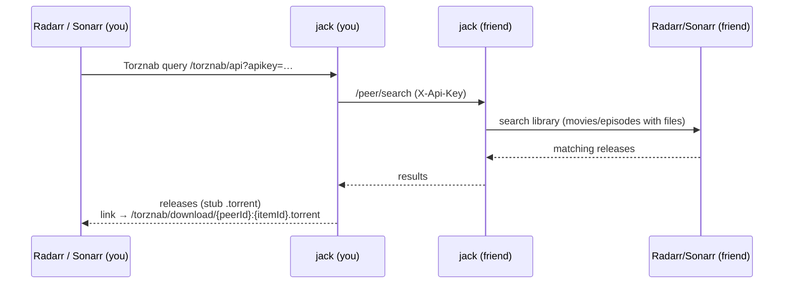
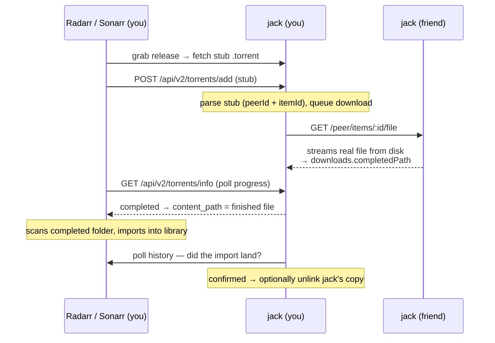

# How it works

There are two flows: **searching** for media (Torznab) and **downloading** it
(the qBittorrent API). The `.torrent` files involved are *not real torrents* —
they're tiny stubs jack hands to *arr, which sends them back to jack through the
qBittorrent download-client API. Nothing ever touches BitTorrent.

## 1. Search flow (Torznab)

The setup happens once, at startup: jack registers itself in each
`destination` Radarr/Sonarr as a **Torznab indexer** and — when `downloads` is
configured — as a **qBittorrent download client**. Both registrations point at
`jack.internalUrl` and authenticate with an auto-issued **managed key**. If
you'd rather register jack yourself, set that server's
[`autoregister.enable`](/reference/configuration#servers-autoregister) to
`false`.

From then on, every search works like this:

1. When you search or monitor something, Radarr/Sonarr query jack's `/torznab`
   endpoint with that managed key.
2. jack **fans the query out to every `peer`** you've configured, calling each
   one's `/peer/search` with the API key that peer issued you.
3. Each peer searches **its own Radarr/Sonarr** library — movies and episodes
   that have files — and returns matching releases, mirroring the *arr file
   metadata.
4. jack turns each match into a Torznab "release" whose download link points
   back at itself: `/torznab/download/<peerId>:<itemId>.torrent`.
5. Radarr/Sonarr show these as grabbable releases — indistinguishable from a
   normal indexer's results.

## 2. Download flow (qBittorrent API)

1. You grab a release. Your *arr's download client is the **qBittorrent**
   client jack registered on startup, pointed at jack's own qBittorrent API —
   so *arr fetches the stub `.torrent` from jack and immediately POSTs it back
   to jack at `/api/v2/torrents/add`.
2. That `.torrent` is a **stub** — bencoded data that just encodes the
   `peerId` and `itemId`. No trackers, no pieces; it's never written to disk.
3. jack parses the stub, finds the matching peer, and queues the download.
4. jack **downloads the real file over HTTP** from that peer's
   `/peer/items/:id/file` endpoint into `downloads.completedPath`.
5. *arr polls jack's `/api/v2/torrents/info` for progress; once jack reports
   the torrent complete, *arr scans the completed folder and imports the file
   into your library, renamed and tracked.
6. jack watches that *arr's history until the import is confirmed, then — if
   you've turned it on — removes its own copy from the completed folder. See
   [After the import](#after-the-import) below.

### After the import

Importing doesn't consume the file in `completedPath`. Radarr and Sonarr read
it and write your library copy; jack's copy stays where it was, and jack has no
further use for it — a finished download is never re-served to peers or
re-imported.

That leaves you with two on-disk outcomes, and which one you get is decided by
your *arr, not by jack:

- **Your *arr hardlinked** (its default when the completed folder and the
  library live on the same filesystem) — the library entry and jack's copy are
  two names for the same bytes. Nothing is duplicated, but the completed folder
  keeps filling with entries you'll never look at.
- **Your *arr copied or moved** (different filesystems, or hardlinks disabled) —
  the library now holds its own bytes, and jack's copy is a genuine second copy
  of every file you've ever grabbed. Left alone, `completedPath` grows without
  bound.

[`downloads.unlinkImportedFiles`](/reference/configuration#downloads-unlinkimportedfiles)
is the switch for this. Turn it on and jack unlinks its copy as soon as the
import is confirmed: in the hardlink case that just drops the redundant
directory entry and your library is untouched, and in the copy case it frees the
space. It's **off by default**, so an instance you set up and forget will
accumulate.

The unlink is deliberately narrow. It runs only on an import jack has confirmed
— the destination *arr reports the download in its history, or the manual import
jack pushed reports `completed` — so a queued, in-progress, or failed import
keeps its file, and so does a file another download still needs. jack removes
that one file and nothing else; it never touches your library.

Flip it from **Settings → Downloads** in the [management
UI](/guide/management-ui) or set it in `config.jsonc`. It's the one key in the
`downloads` block that applies without a restart.

## 3. Serving — being a peer to others

When a friend lists *you* as a peer, their jack calls your `/peer/*` endpoints,
authenticated with the peer API key you issued them:

- `/peer/search` — search your Radarr/Sonarr library.
- `/peer/items/:id` — release metadata.
- `/peer/items/:id/file` — stream the actual file.

jack streams files straight from disk using the paths your Radarr/Sonarr
report, so **the jack process must be able to read your media files at those
same paths** — mount your media into the container the same way your *arr apps
see it.
